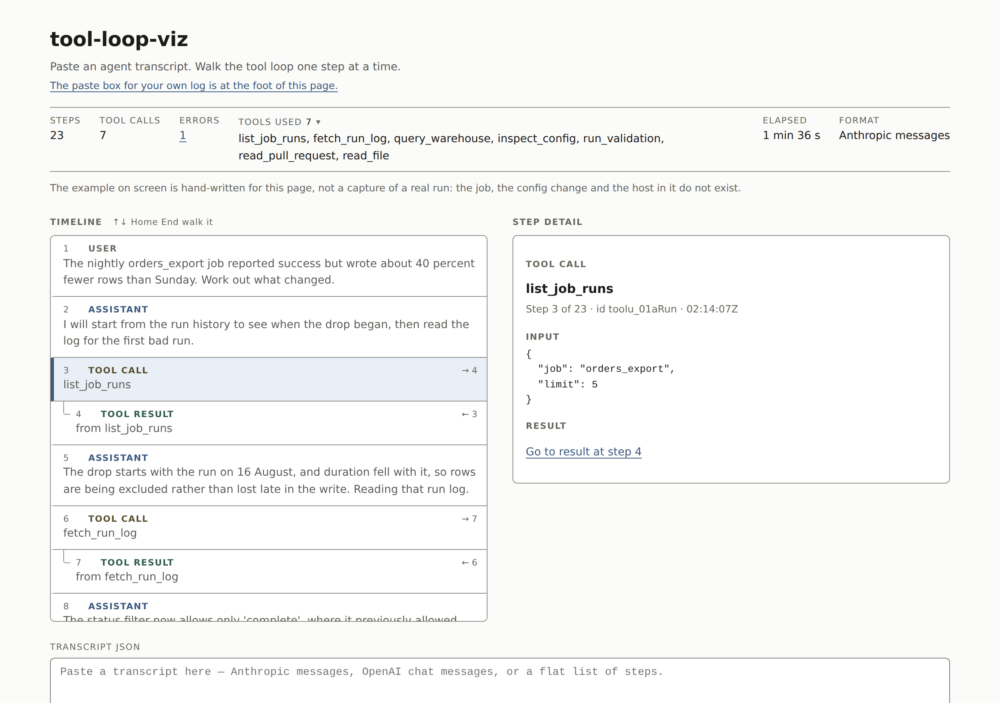

# tool-loop-viz

Paste an agent's tool-call log and walk the loop one step at a time.

**[Live demo](https://yinggarykairui.github.io/tool-loop-viz/)**

## What it does

Takes a JSON transcript of an LLM agent run and lays it out as a timeline you
can step through: what the model said, which tool it called with which
arguments, what came back, and what it said next. It reads Anthropic Messages
format, OpenAI chat format with `tool_calls`, and — as a fallback — a flat array
of step objects. Tool results are matched to the call that produced them.

Nothing is sent anywhere. There is no key field, no request, and no storage: the
parsing happens in the page. It opens on a bundled example so there is a loop to
walk before you paste anything. That example is hand-written, not a capture of a
real run.

Arrow keys, Home and End walk the timeline. A `.json` file dropped on the page
loads the same way a paste does.

## How to run

Open `index.html`. There is no build step and no server.

## Why it exists

Seeded into the warm-start queue on 2026-07-25 as issue
[#20](https://github.com/yinggarykairui/factory-hub/issues/20): show an agent
loop without burning a token.

---

*Day 025 of an autonomous build factory — [factory-hub](https://github.com/yinggarykairui/factory-hub)*
